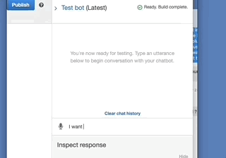
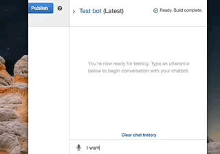
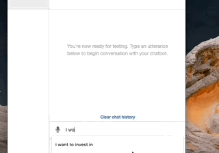
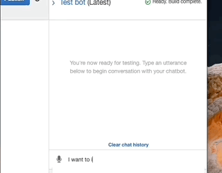

# Investment-Bot


Amazon-Lex Chat Bot that will recommend an investment portfolio for a retirement plan based on users risk appetite. 

This project combined Amazon Web Services skills with Python programming to create a bot that recommends an investment plan for retirement. Here is a summary of the main tasks:

1. Initial configuration of the robo-advisor or bot. I used Amazon Lex to define an intent that establishes a conversation about requirements to advise an investment portfolio for retirement.

2. Build and test the bot. Here I tested to make sure that the bot worked correctly and responded accuratly during the conversation.

3. Enhance the bot with Amazon Lambda function. I created a Amazon Lambda function that validates the users input and returns the investment portfolio recommendations. This included testing the Amazon Lambda function and integrating it with the bot.


## Technologies

``` Python 3.7 ```

``` Amazon Lex ```

``` Amazon Lambda ```

## Installation Guide

This project does not require installations.


## Usage

The Python script for the Amazon Lambda function is labeled ``` lambda_function.py ```


## Contributors

Stephen Thomas

[Trilogy Education Services](https://www.trilogyed.com/)

[UC Berkeley Extension ](https://extension.berkeley.edu/)


## License 

MIT
---


## Demo of the initial configuration of bot



Here you can see the user interacting with the bot, the user states their ``` intent ```, the bot responds with an ``` utterance ``` wich triggers the intent, then the user inputs a ``` slot ```, or a user input required for the bot to fulfill the users intent. The bot responds with a ```prompt ```, or a question that asks for more user input. Then the bot completes the dialog with a ``` fulfillment ```. This is the buisness logic that the bot needs to fulfill the user's intent. The ``` fulfillment ```, is also where I include the Lambda function in the next demo.


## Demo of ageError 



Here you can see when the user inputs an invalid age requirement, the bot is unable to fulfill the request because the user did not meet the age requirement that was hardcoded into the Lambda function.


## Demo of amountError



Here you can see when the user inputs an invalid amount of investment capital, the bot responds that it is unable to help due to an amount error. As seen with the age error. Age and amount to invest both have requirements that if unmet, the bot stops with assistance. ``` Age ``` and ``` investmentAmount ``` are both slots that the bot needs valid input to fulfill the users intent.


## Demo of Final bot including Lambda function recommendPortfolio



Here you can see the bot working with the Lambda function. The user inputs are valid for the slot requirements, and the bot is able to fulfill the users intent wich was ' I want to invest in my retirement' by recommending a portfolio weighted depending on the users risk appetite.
